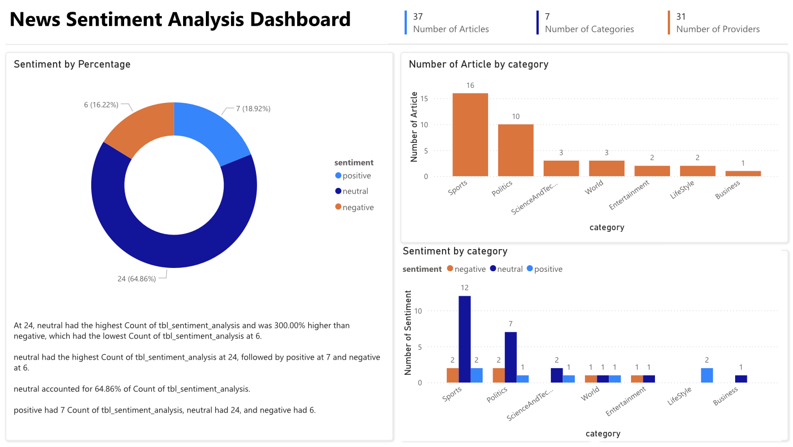

# MS-Fabric-Bing-News-data
## Overview

This project demonstrates a comprehensive data pipeline, combining data engineering with data analysis and visualization. The pipeline processes bing news data in JSON format, performs transformations using PySpark, saves the data in Delta tables, loads the data for sentiment analysis, and visualizes insights using a Power BI dashboard.
## Project Workflow

1. **Data Ingestion:**
    - Ingest Bing news data in JSON format.
    - Use PySpark for data processing and transformation.
    - Save the transformed data in Delta tables in a One lake.

2. **Data Transformation:**
    - Load the JSON data into a PySpark DataFrame.
    - Perform necessary data transformations using PySpark.
    - Save the transformed data to a Delta table in a One lake.

3. **Sentiment Analysis:**
    - Load the transformed data from the Delta table back into a PySpark DataFrame.
    - Perform sentiment analysis on the data using appropriate libraries.
    - Save the results of the sentiment analysis.

4. **Data Visualization:**
    - Create a dashboard to visualize the insights gained from the sentiment analysis.
    - Use visualization tools to present the insights in an easily understandable format.

## Technologies Used

- **PySpark:** For data processing and transformation.
- **Delta Lake:** For efficient storage and management of large data sets.
- **Jupyter Notebook:** For interactive data analysis and development.
- **Sentiment Analysis Libraries:** For performing sentiment analysis on the data.
- **Visualization Tools:** For creating the dashboard to show insights.

 

